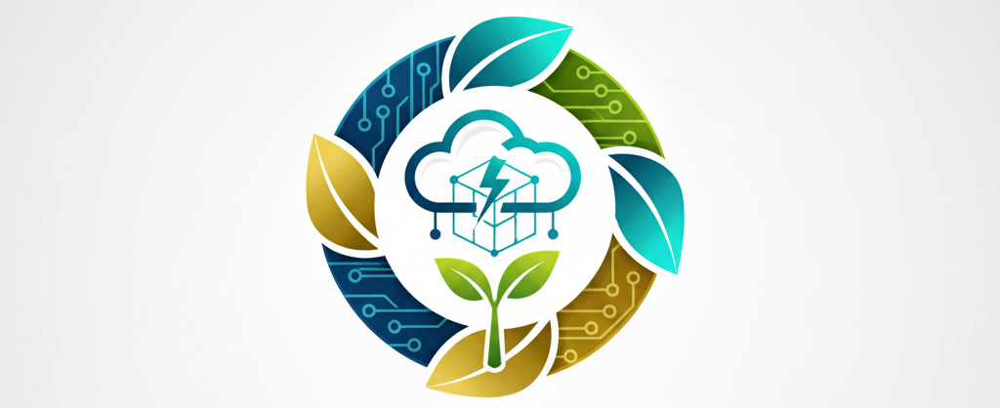
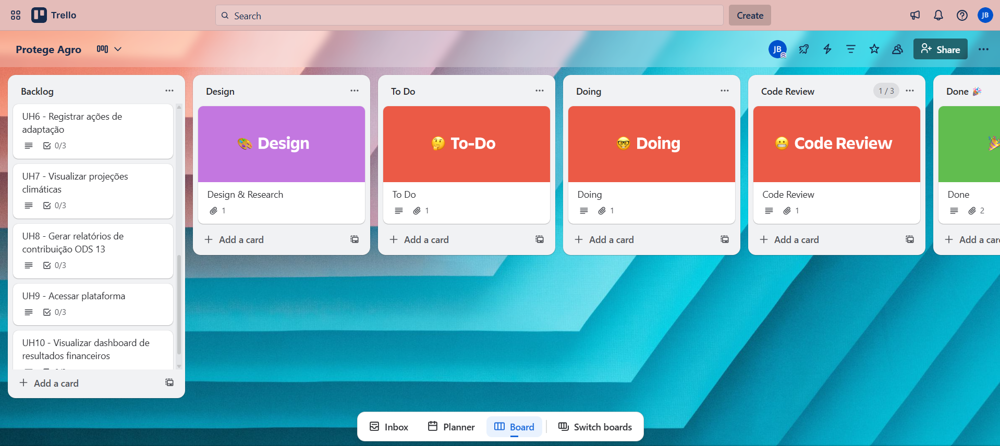

# Protege Agro 👨‍🌾

# ODS 13
- Ação contra a mudança global do clima
Adotar medidas urgentes para combater as alterações climáticas e os seus impactos

13.1 Reforçar a resiliência e a capacidade de adaptação a riscos relacionados ao clima e às catástrofes naturais em todos os países

13.3 Melhorar a educação, aumentar a conscientização e a capacidade humana e institucional sobre mitigação, adaptação, redução de impacto e alerta precoce da mudança do clima

# Problema :

Muitas empresas agrícolas precisam mapear vulnerabilidades climáticas em sua cadeia de diversos produtores, mas enfrentam dificuldades como :

- Dados fragmentados: Informações climáticas espalhadas em planilhas, e-mails e relatórios PDF

- Análise manual: Levam em torno de 3 meses para consolidar riscos de secas, inundações e mudanças sazonais

- Falhas na comunicação: 40% dos produtores não recebem alertas climáticos tempestivos

- Perdas financeiras: Prejuízo médio de R$ 2,5 milhões/ano por eventos climáticos não previstos

# Solução:

Protege Agro - Plataforma de Gestão de Riscos Climáticos

Sistema integrado de monitoramento, alerta e adaptação climática para cadeias produtivas agrícolas; com funcionalidades como :

- Painel de Vulnerabilidade Climática
- Sistema de Alerta Antecipado
- Gestão de Adaptação

# ⚙ Ferramentas 
- [Google Docs](https://docs.google.com/document/d/1KDO9MxiYDKBnw9lnvS85uLl6mBt_EzVFnv6Unucp64M/edit?usp=sharing)
- [Trello](https://trello.com/invite/b/68d2ee91ba3756cc5398c14e/ATTI9f40d8985fac5ee74afa4ea9a23061b68BA59430/projeto)
- [Figma](https://trello.com/invite/b/68d3017f957b203c71729554/ATTIfd6518690457f8129206f304484740d71D224D60/protege-agro)

# Quadro Kanban - Trello

# Integrantes
- [Iza Malafaia](https://github.com/Iza-Malafaia) 
- [Juliana Comparoto](https://github.com/comparoto) 
- [Joanna Farias](https://github.com/Joanna-Farias) 
- [Maria Luiza](https://github.com/alumiria) 
