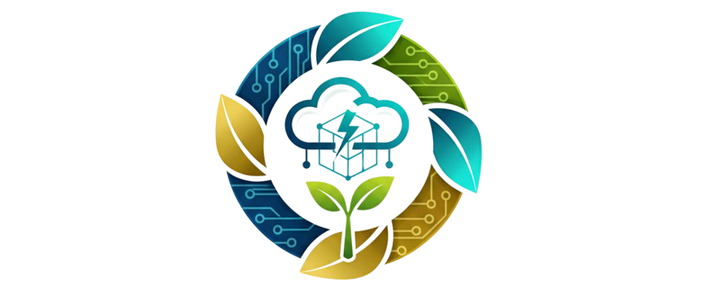
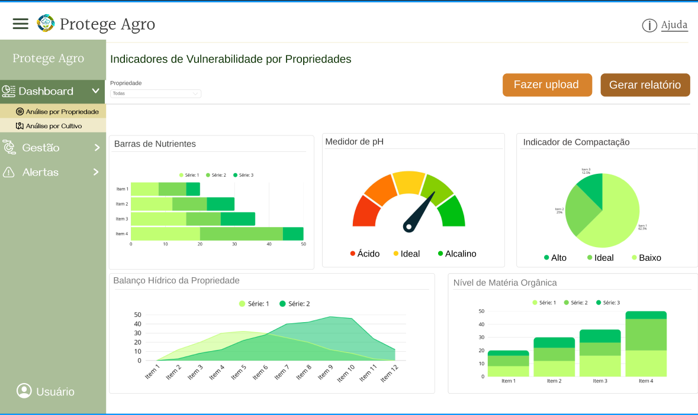
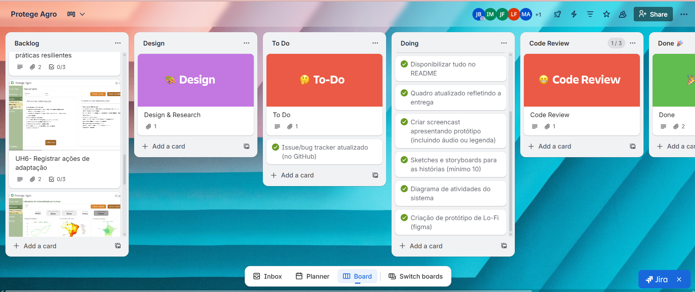
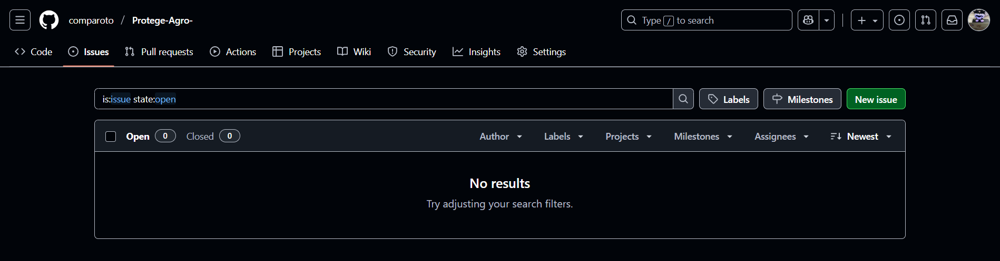

# Protege Agro 👨‍🌾

O projeto Protege Agro está sendo desenvolvido com o objetivo de solucionar o problema do mapeamento da vulnerabilidade climática que muitas empresas do setor agrícola enfrentam, ajudando a integrar dados, monitorar, alertar e adaptar cadeias produtivas. Trata-se de uma plataforma de Gestão de Riscos Climáticos em Cadeias de Suprimentos Agrícolas, com ela, os resultados esperados são de redução nas perdas por eventos climáticos, produtores recebendo alertas com antecedência, aumento na implementação de práticas resilientes e relatórios automáticos de contribuição para adaptação climática e para a [ODS 13](https://brasil.un.org/pt-br/sdgs/13) .

# ⚙ Ferramentas 
- [Trello](https://trello.com/invite/b/68d3017f957b203c71729554/ATTIfd6518690457f8129206f304484740d71D224D60/protege-agro) - Gestão do Projeto
- [Figma](https://www.figma.com/design/D40oNqrRF186K4n1DSMg0C/PROTEGE-AGRO---PROTOTIPO-1?node-id=0-1&t=hrwbZLeeoK0QofQZ-1) - Prototipação do Sistema
- Angular CLI - Front-End
- Java Spring Boot - Back-end (API)

# 💻 Funcionalidades
 O sistema é composto por diversas funcionalidades, incluindo:
- Mapa Interativo que permite visualizar camadas de risco por filtro
- Acesso a um banco de práticas agrícolas resilientes
- Projeções climáticas para os próximos meses
- Planos de ação específicos por tipo de risco climático
- Acompanhamento de eficácia das ações
- Gerar relatórios específicos ou gerais

# 📹 Demonstração do projeto

- [Screencast](https://drive.google.com/file/d/1UqRY5Xc5wz6YIeONaB4KeJ6wc25MrAoK/view?usp=drive_link)
  
# Tela principal 

  

# ✅ Quadro - Trello

# 📋 Diagrama de Atividades

- [Diagrama de Atividades](https://lucid.app/lucidchart/e23a7c07-efd2-42b4-b983-079e704f40e4/edit?viewport_loc=-2330%2C-992%2C5841%2C2580%2C0_0&invitationId=inv_deaa4bf7-fc0c-4252-a694-e9bf0f126398)

# 👾 Issues e bugs tracker

[Issues](https://github.com/comparoto/Protege-Agro-/issues)

# 👥 Programação em pares - experiência

- Iza e Maria Luiza - "Estávamos enfrentando alguns problemas no Front-End, principalmente na parte inicial da aplicação. A programação em pares fez com que essas dificuldades fossem facilmente superadas com a revisão de código simultaneamente e testes realizados com mais frequência."
  
- Juliana e Joanna - "Começamos a utilizar a programação em pares assim que iniciamos os códigos.Como ficamos majoritariamente com a parte do Spring Boot, essa abordagem foi essencial para a correção de erros das APIs e para a realização de testes eficientes." 

# 👩‍💻 Equipe 
- [Iza Malafaia](https://github.com/Iza-Malafaia) 
- [Juliana Comparoto](https://github.com/comparoto) 
- [Joanna Farias](https://github.com/Joanna-Farias) 
- [Maria Luiza](https://github.com/alumiria) 
