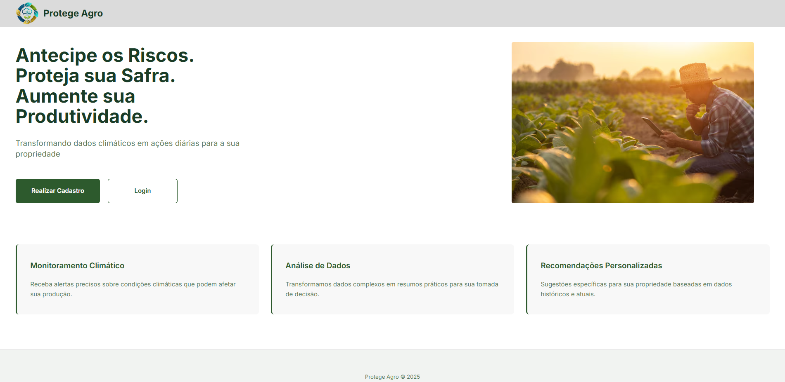
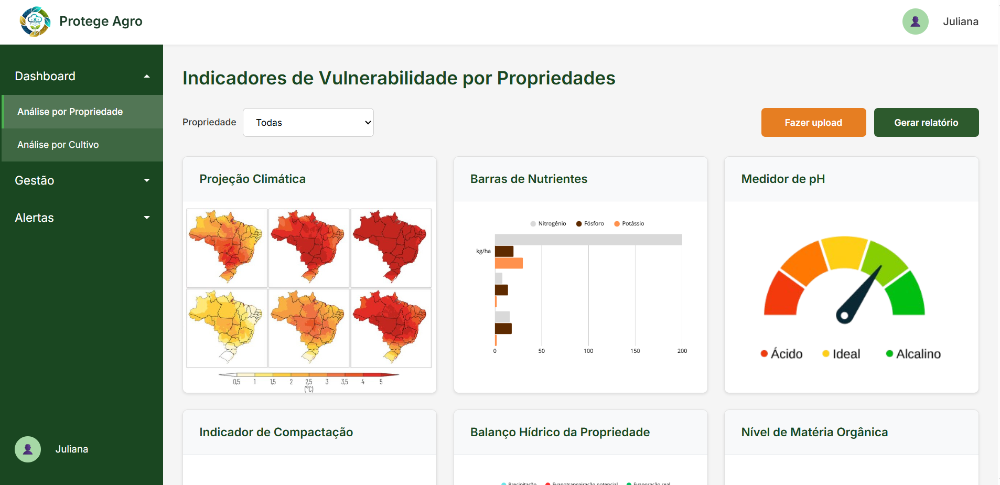
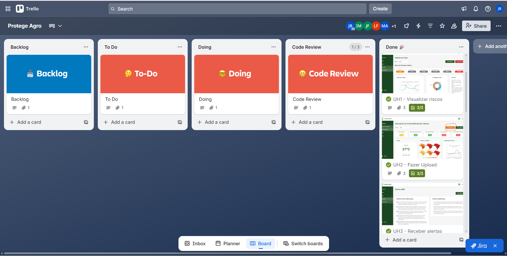
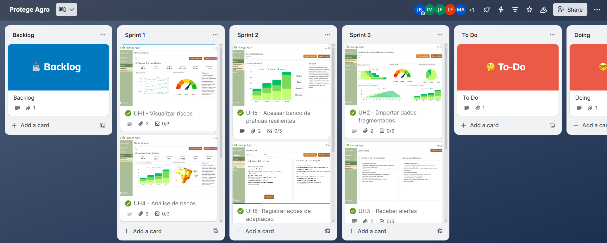
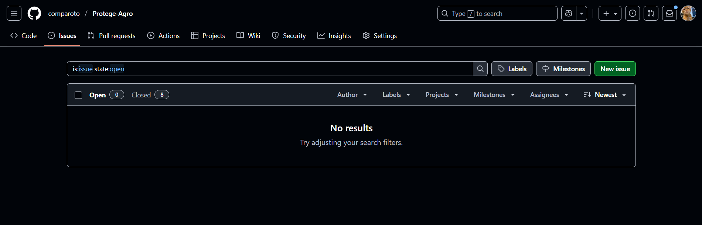

# Protege Agro 👨‍🌾

O projeto Protege Agro está sendo desenvolvido com o objetivo de solucionar o problema do mapeamento da vulnerabilidade climática que muitas empresas do setor agrícola enfrentam, ajudando a integrar dados, monitorar, alertar e adaptar cadeias produtivas. Trata-se de uma plataforma de Gestão de Riscos Climáticos em Cadeias de Suprimentos Agrícolas, com ela, os resultados esperados são de redução nas perdas por eventos climáticos, produtores recebendo alertas com antecedência, aumento na implementação de práticas resilientes e relatórios automáticos de contribuição para adaptação climática e para a [ODS 13](https://brasil.un.org/pt-br/sdgs/13) .

# ⚙ Ferramentas 
- [Trello](https://trello.com/invite/b/68d3017f957b203c71729554/ATTIfd6518690457f8129206f304484740d71D224D60/protege-agro) - Gestão do Projeto
- [Figma](https://www.figma.com/design/D40oNqrRF186K4n1DSMg0C/PROTEGE-AGRO---PROTOTIPO-1?node-id=0-1&t=hrwbZLeeoK0QofQZ-1) - Prototipação do Sistema
- Angular CLI - Front-End
- Java Spring Boot - Back-end 

# 💻 Funcionalidades
 O sistema é composto por diversas funcionalidades, incluindo:
- Mapa Interativo que permite visualizar camadas de risco 
- Acesso a boas práticas agrícolas 
- Projeções climáticas para os próximos meses
- Planos de ação específicos por tipo de risco climático
- Acompanhamento de eficácia das ações
- Gerar relatórios específicos ou geral

# 📹 Documentos/ Arquivos / Screencasts

- [ 📽️ Demonstração do projeto implementado em telas ](https://drive.google.com/file/d/1UqRY5Xc5wz6YIeONaB4KeJ6wc25MrAoK/view?usp=drive_link)
- [ 📽️ Testes de sistema ](https://drive.google.com/drive/folders/1nubKSo0hI0flXN4taropGHaZbeiQywIc?usp=sharing)
- [ 💻 DEPLOY](https://protege-agro-site.onrender.com)
- [ 📄 Configurando Ambiente Dev](https://docs.google.com/document/d/1_AT1_uWjzGIP6CKZm2aR2wxMMDq8Yy9EOQ8_LANWxvY/edit?usp=sharing)
- [ 📁 Arquivos ZIP](https://drive.google.com/drive/folders/1Je6x58tEThfhYkg-JhAMgvvaDkHmQvFk?usp=sharing)
  
# Tela inicial 

  
  
# Tela principal funcionalidade

  

# ✅ Tela do quadro Kanban

# 📋 Diagrama de Atividades

- [Diagrama de Atividades](https://lucid.app/lucidchart/e23a7c07-efd2-42b4-b983-079e704f40e4/edit?viewport_loc=-2330%2C-992%2C5841%2C2580%2C0_0&invitationId=inv_deaa4bf7-fc0c-4252-a694-e9bf0f126398)

# 👾 Issues e bugs tracker

[Issues](https://github.com/comparoto/Protege-Agro-/issues)

# 🔔 Status do projeto

✅ Definição do problema e solução

✅ Criação das histórias de usuário

✅ Prototipação no FIGMA

✅ Desenvolvimento do código

✅ Testes de confirmação

✅ Deploy

# 👥 Programação em pares - experiência

- Iza e Maria Luiza - Primeiro relato: "Estávamos enfrentando alguns problemas no Front-End, principalmente na parte inicial da aplicação. A programação em par fez com que essas dificuldades fossem facilmente superadas com a revisão de código simultânea e testes realizados com mais frequência." 
                      Relato final: "Depois de tentar continuar a programação de forma independente (sem ser em par), percebemos que levaríamos muito mais tempo; então resolvemos continuar com a programação em par até o final, e foi uma decisão ótima."
  
- Juliana e Joanna - Primeiro relato: "Começamos a utilizar a programação em par assim que iniciamos os códigos.Como ficamos majoritariamente com a parte do Spring Boot, essa abordagem foi essencial para a correção de erros da API e para a realização de testes eficientes."  
                       Relato final: : "Ao final de tudo, continuamos com nossa opinião de que teria sido bem mais complicado a realização desse projeto sem a programação em par."

# 👩‍💻 Equipe 
- [Iza Malafaia](https://github.com/Iza-Malafaia) 
- [Juliana Comparoto](https://github.com/comparoto) 
- [Joanna Farias](https://github.com/Joanna-Farias) 
- [Maria Luiza](https://github.com/alumiria) 
