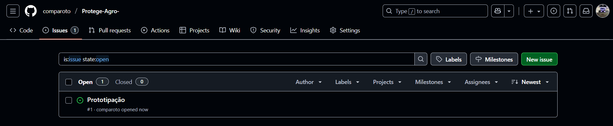

# Protege Agro 👨‍🌾

O projeto Protege Agro está sendo desenvolvido com o objetivo de solucionar o problema do mapeamento da vulnerabilidade climática que muitas empresas do setor agrícola enfrentam, ajudando a integrar dados, monitorar, alertar e adaptar cadeias produtivas. Trata-se de uma plataforma de Gestão de Riscos Climáticos em Cadeias de Suprimentos Agrícolas, com ela, os resultados esperados são de redução nas perdas por eventos climáticos, produtores recebendo alertas com antecedência, aumento na implementação de práticas resilientes e relatórios automáticos de contribuição para adaptação climática e para a [ODS 13](https://brasil.un.org/pt-br/sdgs/13) .

# ⚙ Ferramentas 
- [Trello](https://trello.com/invite/b/68d3017f957b203c71729554/ATTIfd6518690457f8129206f304484740d71D224D60/protege-agro) - Gestão do Projeto
- [Figma](https://www.figma.com/design/D40oNqrRF186K4n1DSMg0C/PROTEGE-AGRO---PROTOTIPO-1?node-id=0-1&t=hrwbZLeeoK0QofQZ-1) - Prototipação do Sistema

  # Tela principal - Figma

  

# 📋 Diagrama de Atividades

- [Diagrama de Atividades](https://lucid.app/lucidchart/e23a7c07-efd2-42b4-b983-079e704f40e4/edit?viewport_loc=-2330%2C-992%2C5841%2C2580%2C0_0&invitationId=inv_deaa4bf7-fc0c-4252-a694-e9bf0f126398)

# 🎞 Sketches e Storyboards 

- [Sketches e Storyboards](https://docs.google.com/document/d/1Epuxz50EGQDTCdjHtUGG2fdJO8yq-qMKmHMf1PV1Qv0/edit?usp=sharing)

# 📹 Screencast 

- [Screencast](https://drive.google.com/file/d/1UqRY5Xc5wz6YIeONaB4KeJ6wc25MrAoK/view?usp=drive_link)

# 👾 Issues e bugs tracker

  
# ✅ Quadro - Trello

# 👩‍💻 Equipe 
- [Iza Malafaia](https://github.com/Iza-Malafaia) 
- [Juliana Comparoto](https://github.com/comparoto) 
- [Joanna Farias](https://github.com/Joanna-Farias) 
- [Maria Luiza](https://github.com/alumiria) 
